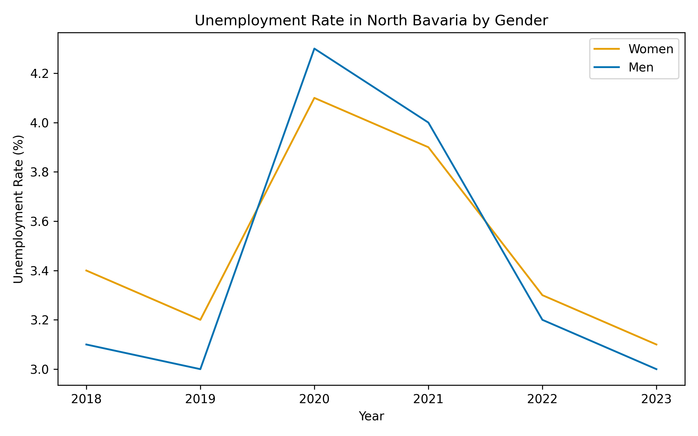

## 📊 Gender Differences in Unemployment in Northern Bavaria

This project analyzes gender-specific differences in unemployment rates in **Northern Bavaria**
over the period **2018–2023** using official regional statistics.

The analysis focuses on identifying **temporal trends** and **gender-based disparities**
rather than proposing direct political measures. The project is designed as an
**exploratory data analysis** that supports data-driven discussion on regional labor
market inequalities.

---

## 🎯 Project Objective

The main objective of this project is to examine whether unemployment rates differ
systematically between **women and men** in Northern Bavaria and how these differences
develop over time.

The project explores:
- Gender-specific unemployment trends
- The evolution of the gender gap
- Overall labor market dynamics in Northern Bavaria

---

## ⚖️ Analysis Dimensions

### Women
Analysis of unemployment rates among women over time.

### Men
Analysis of unemployment rates among men over the same period.

### Gender Gap
Calculation of the difference between female and male unemployment rates
(Women − Men) to identify gender-specific inequalities.

### Overall Unemployment
Average unemployment rate across genders to provide a general labor market overview.

---

## 🚀 Features

- **Automated Data Processing**  
  CSV-based statistical data is loaded, cleaned, and transformed using pandas.

- **Comparative Gender Analysis**  
  Direct comparison between women and men across multiple years.

- **Gender Gap Calculation**  
  Quantifies differences in unemployment rates.

- **Automated Plot Generation**  
  Clear and reproducible visualizations using Matplotlib.

- **Reproducibility**  
  Deterministic results based on fixed input data and scripts.

---

## 📁 Project Structure
Arbeitslosigkeit_Deutschland/
│
├── data/
│   └── raw/
│       └── arbeitslosigkeit_nordbayern_gender_2018_2023.csv
│
├── Outputs/
│   ├── 01_women_vs_men.png
│   ├── 02_gender_gap.png
│   └── 03_overall_trend.png
│
├── src/
│   ├── config.py
│   ├── data_loader.py
│   ├── plots.py
│   └── utils.py
│
├── main.py
├── requirements.txt
└── README.md

---

## 📊 Outputs

### 👩‍🦰👨‍🦱 Women vs. Men

Comparison of unemployment rates for women and men in Northern Bavaria over time.



---

### ⚖️ Gender Gap

Visualization of the difference between female and male unemployment rates
(Women − Men).


---

### 🌍 Overall Unemployment

Trend of the average unemployment rate across genders.


---

## 🧩 Code Overview

### config.py
Defines file paths, output directories, and visualization settings
(colors, figure size, resolution).

### data_loader.py
Loads the CSV dataset, cleans the data, reshapes it into a usable format,
and computes the gender gap.

### plots.py
Generates all visualizations and saves them automatically to the Outputs folder.

### utils.py
Contains small helper functions (e.g., ensuring output directories exist).

---

## 📈 Interpretation of Results

The analysis shows that unemployment rates for women in Northern Bavaria are
consistently slightly higher than those for men throughout the observed period.
The size of the gender gap fluctuates over time, indicating that gender-specific
disparities are influenced by broader economic conditions.

The overall unemployment trend reflects structural labor market developments
and highlights periods of economic stress and recovery.

---

## 🛠 Installation and Usage

### Install Dependencies
```bash
pip install -r requirements.txt
```

### Run the Analysis
```bash 
python main.py
```

All output figures will be generated automatically in the Outputs/ directory.

## 📚 Notes on Data

The dataset is based on aggregated regional unemployment statistics
for Northern Bavaria. The analysis does not differentiate between individual
cities or districts but focuses on regional-level trends.

## ⚠️ Disclaimer

This project serves academic and illustrative purposes.
It does not claim completeness or policy relevance, but aims to support
data-driven discussion on regional labor market inequalities
